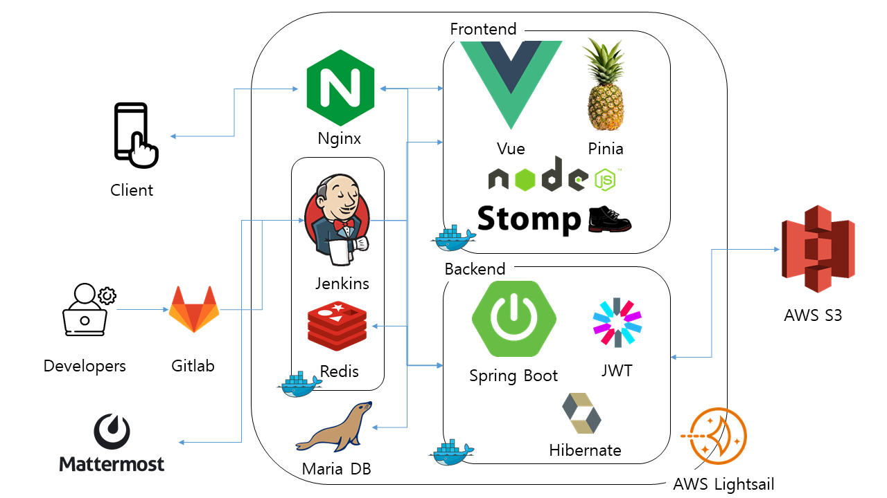

# WalkyTalky


<br>

## 프로젝트 소개

---

- WalkyTalky는 산책을 좋아하는 사람들이 본 서비스를 이용하여 산책을 한 뒤 자신의 산책 기록을 공유하고 같이 산책 할 사람들을 구하여 산책을 할 수 있는 서비스입니다.
- 사용자가 산책을 시작하면 실시간으로 지도에 산책 경로가 표시되며 산책을 마친 후에는 자신의 산책의 제목, 한줄평, 별점을 기록하고 확인 할 수 있습니다.
- 다른 사용자와 산책을 하고 싶은 사용자는 소모임을 모집하여 산책 일정을 관리하고 이야기를 나눌 수 있습니다.
- 자신의 산책 기록을 다른 사용자와 공유하고 싶은 사용자는 산책 기록 공유 게시판을 통해 다른 사용자들과 자신의 기록을 공유할 수 있습니다.
- 지도를 통해 원하는 사용자의 산책 기록을 확인하며 산책 할 수 있습니다.

## 팀원 구성

---

|                                   김진용                                   |                                   강민정                                   |                                   김연화                                    |                                   신우섭                                   |                                   임덕기                                    |
| :------------------------------------------------------------------------: | :------------------------------------------------------------------------: | :-------------------------------------------------------------------------: | :------------------------------------------------------------------------: | :-------------------------------------------------------------------------: |
|  |  |  |  |  |
|               [@jinyong3512](https://github.com/jinyong3512)               |                    [@min922](https://github.com/min922)                    |                 [@myeon0109](https://github.com/myeon0109)                  |                 [@Wooseobee](https://github.com/Wooseobee)                 |                    [@DKIMDK](https://github.com/DKIMDK)                     |

## 개발 기간

---

2024.01.08 - 2024.02.16 (6주)

## 기술 스택

---

- Front : Vue, StompJS
- Back-end : Spring Boot, Redis, MariaDB
- 버전 및 이슈관리 : Gitlab
- 협업 툴 : Discord, Notion, Jira, Mattermost
- 서비스 배포 환경 : AWS Lightsail
- CI/CD : Jenkins

## 프로젝트 구조

---

<details>
<summary>Frontend</summary>

```
└──src
    ├──assets
    │   └──img
    │
    ├──components
    │   ├──common
    │   │   ├──ButtonWithIcon
    │   │   ├──ClubDetailHeaderNav
    │   │   ├──TheFooter
    │   │   ├──TheHeaderNav
    │   │   ├──CourseFeed
    │   │   └──WalkHeaderNav
    │   ├──chat
    │   │   ├──Message
    │   │   └──MessageList
    │   ├──club
    │   │   └──ClubList
    │   ├──member
    │   │   └──MemberListView
    │   ├──walk
    │   │   ├──StarRating
    │   │   ├──StopWatch
    │   │   └──RecordModifyModal
    │   └──shareboard
    │       ├──shareBoardComment
    │       ├──shareBoardCommentForm
    │       ├──shareBoardLike
    │       ├──shareBoardListItem
    │       ├──shareBoardListUpper
    │       ├──shareBoardMember
    │       ├──shareBoardRecord
    │       ├──shareBoardScrap
    │       └──shareBoardTitle
    │
    ├──router
    │   └──index
    │
    ├──stores
    │   ├──chat
    │   ├──jwtFilter
    │   ├──counter
    │   ├──club
    │   ├──member
    │   ├──shareboard
    │   └──walk
    │
    ├──views
    │   ├──club
    │   │   ├──ClubView
    │   │   ├──ClubDetailView
    │   │   ├──ClubCreateView
    │   │   ├──ClubPlanDetail
    │   │   ├──ClubPlanOverwrite
    │   │   ├──ClubPlanRegist
    │   │   ├──ClubPlanView
    │   │   ├──ClubSettingApplicantView
    │   │   ├──ClubSettingClubView
    │   │   ├──ClubSettingHeaderNav
    │   │   ├──ClubSettingMemberView
    │   │   └──ClubChatView
    │   ├──member
    │   │   ├──Login
    │   │   ├──Logout
    │   │   ├──ModifyInfo
    │   │   ├──MyLocationView
    │   │   ├──Mypage
    │   │   ├──RecordScrapList
    │   │   └──Signup
    │   ├──shareboard
    │   │   ├──ShareBoardView
    │   │   ├──ShareBoardDetailView
    │   │   ├──ShareBoardModifyView
    │   │   └──ShareBoardWriteView
    │   ├──walk
    │   │   ├──DoWalk
    │   │   ├──RecommendView
    │   │   ├──ScrapDetaillView
    │   │   ├──ScrapListView
    │   │   ├──WalkDetaillView
    │   │   └──WalkList
    │   └──Homewview

```

</details>
<details>
<summary>Backend</summary>

```
└── src
    ├── main
    │   ├── java
    │   │   └── com
    │   │       └── ssafy
    │   │           └── backend
    │   │               ├── BackendApplication.java
    │   │               ├── member
    │   │               │   ├── controller
    │   │               │   ├── domain
    │   │               │   ├── dto
    │   │               │   ├── repository
    │   │               │   └── service
    │   │               ├── group
    │   │               │   ├── controller
    │   │               │   ├── domain
    │   │               │   ├── dto
    │   │               │   ├── repository
    │   │               │   └── service
    │   │               ├── record
    │   │               │   ├── controller
    │   │               │   ├── domain
    │   │               │   ├── dto
    │   │               │   ├── repository
    │   │               │   └── service
    │   │               ├── shareBoard
    │   │               │   ├── controller
    │   │               │   ├── domain
    │   │               │   ├── dto
    │   │               │   ├── repository
    │   │               │   └── service
    │   │               ├── shareBoardComment
    │   │               │   ├── controller
    │   │               │   ├── domain
    │   │               │   ├── dto
    │   │               │   ├── repository
    │   │               │   └── service
    │   │               ├── global
    │   │               │   ├── config
    │   │               │   │   ├── SwaggerConfig.java
    │   │               │   │   ├── properties
    │   │               │   │   ├── resttemplate
    │   │               │   │   └── security
    │   │               │   ├── error
    │   │               │   │   ├── ErrorResponse.java
    │   │               │   │   ├── GlobalExceptionHandler.java
    │   │               │   │   └── exception
    │   │               │   └── util
    │   └── resources
    │       └── application.yml

```

</details>
## 아키텍처

---



## 문서

---

- [ERD](https://www.erdcloud.com/d/Sh9PxS3MDoB7fyCyC)
- [API 명세서](https://www.notion.so/ee47fd310c7b40d4b581b4f313514baa?pvs=21)
- [Figma](https://www.figma.com/file/QcdcQyWpdbUQMWfj0cwQ5A/WalkyTalky?type=design&node-id=0-1&mode=design&t=4vfgV5hQb4Y1JbKe-0)
- [코드 및 커밋 컨벤션](https://www.notion.so/Git-bfca2331473a433a8ff5c9eeb0d76bfb?pvs=21)

## 역할 분담

---

- 신우섭
  - Infra
    - 서버 구축
    - Jenkins CI/CD 구축
  - UI
    - 카카오 로그인
    - 소모임 채팅
  - 기능
    - Oauth - 카카오 로그인 구현
    - Chatting - 소모임 가입자들간의 채팅 구현
    - S3 Image Upload 구현
- 임덕기
  - UI
    - 홈
    - 로그인, 로그아웃
    - 마이페이지 조회 및 수정
    - 내 위치 주소 불러오기
    - 네비게이션 바
  - 기능
    - KaKaoMap API (Geolocation)
    - Router guard
    - 로그인, 로그아웃, 회원 탈퇴
- 강민정
  - UI
    - 산책 기록 공유 게시판 게시글 작성, 수정, 상세 조회, 목록 조회, 삭제
    - 내 기록 목록 조회, 상세 조회
    - 스크랩 한 기록 목록 조회, 상세 조회
    - 추천 기록 목록 조회
    - 기록 따라 뛰기
  - 기능
    - 로컬 로그인 및 로그아웃 API
    - jwt 사용자 인증 로직 구현 - Frontend, Backend
    - 회원 정보 조회 API
    - 비밀번호 수정 API
    - 회원 정보 수정 API
    - 회원 탈퇴 API
    - 산책 기록 관련 API
    - 산책 기록 추천 관련 API
    - 산책 기록 스크랩 관련 API
    - 산책 기록 공유 게시판, 댓글, 좋아요 관련 API
- 김연화
  - UI
    - 산책기록 페이지
    - 회원가입(로컬)
  - 기능
    - 산책 시작하기
    - 산책 일시정지
    - 산책 중단
    - 산책 기록하기
    - 로컬 회원가입
    - 회원가입 정보(아이디, 닉네임, 비밀번호) 유효성 검사

## 기능 시연

---

여기 이제 움짤이랑 각자 기능 설명들 넣으면 됨

- 카카오 로그인

    

- 채팅

  - 소모임 가입, 탈퇴시 채팅방 알림 구현
  - 소모임원들만 채팅방에 접근할 수 있게 제한
  - 가입 이전의 내용은 확인 불가

    

- 로컬 회원가입 및 로그인

  - 카카오 맵 api의 geolocation을 활용, gps상의 좌표로 주소를 가져와 내 동네 저장
  - 닉네임, 아이디 중복 등 유효성검사
  - 로그인 시 네비게이션바에 프로필 사진과 닉네임, 마이페이지 및 로그아웃 항목 렌더링
    

- 라우터가드

  - 비 로그인 상태일 때 클럽, 산책 등 주소로 접근 방지
  - 로그인 상태일 때 로그인, 회원가입 주소로 접근 방지
    

- 마이페이지

  - 내 정보 렌더링
  - 프로필 사진, 닉네임, 소개, 내 동네, 비밀번호 수정 가능
  - 유효성검사 시행
  - 회원탈퇴 기능
    

- 산책하기

  - 산책하기
  - 사용자의 산책을 GPS와 KakaoMap을 이용해 실시간으로 추적하여 거리, 시간을 측정하고, 경로를 지도에 그린다.
  - 산책 종료 시 기록을 DB에 저장한다

  

- 따라 산책하기

  - 따라 산책
  - 따라 걸을 라인(빨간색)이 뜨고, 내가 걷는 라인(노란색)도 역시 보여짐
  - 따라 산책후 기록 입력

   &nbsp; 

- 산책 기록 공유 게시판
  - 산책 기록 공유 게시글 목록 조회
  - 산책 기록 공유 게시글 작성
    - 제목이나 내용을 입력하지 않거나 공유 할 기록을 선택하지 않으면 글을 작성하지 못함
  - 산책 기록 공유 게시글 상세 조회
  - 산책 기록 공유 게시글 수정
  - 산책 기록 공유 게시글 삭제
  - 산책 기록 공유 게시글 댓글 작성
  - 산책 기록 공유 게시글 댓글 수정
  - 산책 기록 공유 게시글 댓글 삭제
  - 산책 기록 공유 게시글 좋아요
    - 자신의 글은 좋아요를 누를 수 없음
  - 산책 기록 공유 게시글 좋아요 취소
- 산책 기록 스크랩
  - 산책 기록 공유 게시글 스크랩
    - 자신의 글은 스크랩 할 수 없음
  - 산책 기록 공유 게시글 스크랩 취소
  - 산책 기록 공유 기록 스크랩 확인
  - 스크랩 한 코스 상세 보기
- 나의 산책 기록
  - 내 기록 목록 조회
  - 내 기록 상세 조회
  - 내 기록 수정
  - 내 기록 삭제
- 산책 기록 추천
  - 사용자의 동네에 기반하여 해당 동네의 산책 기록을 필터링 하여 보여줌
  - 사용자의 정보에 기반하여 유사한 사용자의 산책 기록을 필터링 하여 보여줌
  - 추천 받은 기록이 기호에 부합하지 않으면 해당 기록을 더 이상 추천 받지 않을 수 있음

## 구동 방법

---

1. Clone Project

```bash
git clone https://lab.ssafy.com/s10-webmobile2-sub2/S10P12A808.git
```

1. change path to /frontend & npm install

```bash
npm i
```

1. create .env file

```bash
VITE_KAKAO_API_KEY = {kakao JavaScript API key}
VITE_KAKAO_CLIENT_Id = {kakao REST API key}
VITE_KAKAO_REDIRECT_URI = {service url}/member/local-signup
VITE_MARKER_IMAGE_ROUTE = https://walkytalky.s3.ap-northeast-2.amazonaws.com/marker/
```

1. frontend start

```bash
npm run dev
```

1. change path to /backend/src/main

```bash
mkdir resources
```

1. change path to /backend/src/main/resources

```bash
cd resources
```

1. create application.yml

```bash
server:
  port: {spring boot application port number}

spring:
  datasource:
    driver-class-name: {database class name}
    url: {MariaDB connect url}
    username: {MariaDB username}
    password: {MariaDB password}

  data:
    redis:
      host: {service url}
      port: {redis port number}
      password: {redis password}

  servlet:
    multipart:
      max-file-size: {max-file-size}
      max-request-size: {max-request-size}

management:
  endpoints:
    jmx:
      exposure:
        include: "health"

security:
  salt: {JWT secret value}

cloud:
  aws:
    credentials:
      access-key: {S3 access-key}
      secret-key: {S3 secret-key}
    region:
      static: {S3 region}
      auto: false
    stack:
      auto: false
    s3:
      bucket: {S3 Bucket name}

oauth:
  kakao:
    client-id: {kakao REST API key}
    client-secret: {kakao login Client Secret}
    redirect-uri: {service url}/member/local-signup
    request-token-uri: https://kauth.kakao.com/oauth/token
    request-user-info-uri: https://kapi.kakao.com/v2/user/me
```
